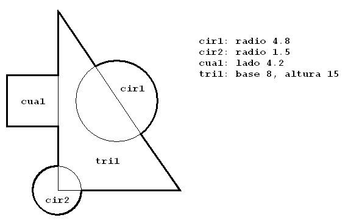

##### *Desarrollo Web en Entorno Servidor - Curso 2017/2018 - IES Leonardo Da Vinci - Alberto Ruiz*
## U0P05 - Figuras
#### Entrega de: *Pablo Villar García*
----

#### 1. Descripción:

Vamos a utilizar el enfoque orientado a objetos para solucionar un problema trigonométrico, repasando conceptos como clases y objetos, herencia y polimorfismo, colecciones, o JavaDoc.

#### 2. Formato de entrega:

Incluye al final de este documento el código de las clases que hayas programado, así como el resultado de ejecución.

Puedes utilizar bloques de código Markdown o capturas de Eclipse.

#### 3. Trabajo a realizar:

#### Parte 1: Clases y objetos

Crea un paquete llamado `figuras` y codifica las clases Cuadrado, Triangulo y Circunferencia. Incluye en todas un método para imprimir sus datos. Después codifica una clase *Problema* que calcule el área y el perímetro de la siguiente figura:



##### Código de la clase Cuadrado:

```java
private double lado;
	private double area;
	private double perimetro;
	
	public double getLado() {
		return lado;
	}
	public void setLado(double lado) {
		this.lado = lado;
	}
	public Cuadrado() {
		
	}
	public Cuadrado(double lado) {
		this.lado=lado;
	}

	public double perimetro() {
		
		perimetro=4*lado;
		
		return perimetro;
	}
	
	public double area() {
		
		area = lado*lado;
		
		return area;
	}
	@Override
	public String toString() {
		return "Cuadrado [lado=" + lado + ", perimetro()=" + perimetro() + ", area()=" + area() + "]";
	}
```

##### Código de la clase Triángulo:

```java
private double altura;
	private double base;
	private double h;
	private double area;
	private double perimetro;
	
	
	public double getAltura() {
		return altura;
	}
	public void setAltura(double altura) {
		this.altura = altura;
	}
	public double getBase() {
		return base;
	}
	public void setBase(double base) {
		this.base = base;
	}
	public double getH() {
		return h;
	}
	public void setH(double h) {
		this.h = h;
	}
	public Triangulo() {
		
	}
	public Triangulo(double base, double altura) {
		this.base=base;
		this.altura=altura;
		this.h=Math.sqrt(base*base+altura*altura);
	}
	
	public double perimetro() {
		
		perimetro=altura+h+base;
		
		return perimetro;
	}
	
	public double area() {
		
		area = (base*altura)/2;
		
		return area;
	}
	@Override
	public String toString() {
		return "Triangulo [altura=" + altura + ", base=" + base + ", h=" + h + ", perimetro()=" + perimetro()
				+ ", area()=" + area() + "]";
	}
	
```


##### Código de la clase Circunferencia:

```java
private double radio;
	private double area;
	private double perimetro;
	
	public double getRadio() {
		return radio;
	}
	public void setRadio(double radio) {
		this.radio = radio;
	}
	public Circulo() {
		
	}
	public Circulo(double radio) {
		this.radio=radio;
	}
	
	public double perimetro() {
		
		perimetro=2*3.14*radio;
		
		return perimetro;
	}
	
	public double area() {
		
		area = 3.14*radio*radio;
		
		return area;
	}
	@Override
	public String toString() {
		return "Circulo [radio=" + radio + ", perimetro()=" + perimetro() + ", area()=" + area() + "]";
	}
	
```


##### Código del método main en la clase Problema:

```java
public static void main(String[] args) {
		
		double areatotal;
		double perimetrototal;
		
		Cuadrado c= new Cuadrado(4.2);
		Triangulo t = new Triangulo(8,15);
		Circulo c1 = new Circulo(4.8);
		Circulo c2 = new Circulo(1.5);
		
		
		
		areatotal=((c1.area()/2)+(c2.area()*0.75)+c.area()+t.area());
		perimetrototal=(c.perimetro()*0.75+c2.perimetro()*0.75+c1.perimetro()*0.5)+(t.perimetro()-(c.getLado()+c1.getRadio()*2+c2.getRadio()*2));
		
		System.out.println(c.toString());
		System.out.println(c1.toString());
		System.out.println(c2.toString());
		System.out.println(t.toString());
		
		System.out.println("El perimetro total es:"+perimetrototal+" y el area total es:"+areatotal);
	}

```


##### Ejecución del método main:

Cuadrado [lado=4.2, perimetro()=16.8, area()=17.64]
Circulo [radio=4.8, perimetro()=30.144, area()=72.34559999999999]
Circulo [radio=1.5, perimetro()=9.42, area()=7.0649999999999995]
Triangulo [altura=15.0, base=8.0, h=17.0, perimetro()=40.0, area()=60.0]
El perimetro total es:57.937 y el area total es:119.11155


#### Parte 2: Herencia

Queremos que todas las figuras tengan un título y un color. Para el color puedes utilizar un tipo enumerado Color con al menos cinco valores.

1. Define una clase Figura con estos nuevos atributos
- Haz que nuestras clases de figuras hereden dichos atributos
- ¿Crees que la clase Figura debería ser abstracta? ¿Y los métodos de calcular áreas y perímetros? Si es así haz las modificaciones necesarias
- Utilizando la *reescritura*, haz que de cada figura se impriman en pantalla tanto sus atributos heredados (color y título) como los propios de esa figura particular.
- Crea una clase Principal con un método main en el que instancies diferentes figuras por este procedimiento y escribas sus datos por pantalla.

##### Código de la clase Figura:

```java
public abstract class Figura {

	private String titulo ;
	private Color color ;
	
	abstract public double calcularPerimetro();
	
	abstract public double calcularArea();
	
	public String getTitulo() {
		return titulo;
	}

	public void setTitulo(String titulo) {
		this.titulo = titulo;
	}

	public Color getColor() {
		return color;
	}

	public void setColor(Color color) {
		this.color = color;
	}

	@Override
	public String toString() {
		return "Figura [titulo=" + titulo + ", color=" + color + "]";
	}

```


##### Código de la clase Cuadrado una vez modificada:

```java
public class Cuadrado  extends Figura {

	private double lado;
	private double area;
	private double perimetro;
	
	public double getLado() {
		return lado;
	}
	public void setLado(double lado) {
		this.lado = lado;
	}
	public Cuadrado() {
		
	}
	public Cuadrado(double lado ,Color color, String titulo) {
		super.setColor(color);
		super.setTitulo(titulo);
		this.lado=lado;
	}

	public double calcularPerimetro() {
		
		perimetro=4*lado;
		
		return perimetro;
	}
	
	public double calcularArea() {
		
		area = lado*lado;
		
		return area;
	}
	@Override
	public String toString() {
		return super.toString()+"Cuadrado [lado=" + lado + ", perimetro()=" + calcularPerimetro() + ", area()=" + calcularArea() + "]";
	}
```


##### Código del método main en la clase Principal:

```java
public class Principal {

	public static void main(String[] args) {

		Cuadrado c= new Cuadrado(4.2,Color.Azul,"Cuadrado1");
		Cuadrado c2= new Cuadrado(23,Color.Rosa,"Cuadrado2");
		Triangulo t = new Triangulo(8,15,Color.Rojo,"Triangulo1");
		Triangulo t2 = new Triangulo(8,11,Color.Verde,"Triangulo2");
		Circulo c1 = new Circulo(4.8,Color.Negro,"Circulo1");
		Circulo c3 = new Circulo(1.5,Color.Verde,"Circulo2");
		
		System.out.println(c.toString());
		System.out.println(c2.toString());
		System.out.println(t.toString());
		System.out.println(t2.toString());
		System.out.println(c1.toString());
		System.out.println(c3.toString());
			
		
	}

```


##### Ejecución del método main:

``` 
Figura [titulo=Cuadrado1, color=Azul]Cuadrado [lado=4.2, perimetro()=16.8, area()=17.64]
Figura [titulo=Cuadrado2, color=Rosa]Cuadrado [lado=23.0, perimetro()=92.0, area()=529.0]
Figura [titulo=Triangulo1, color=Rojo]Triangulo [altura=15.0, base=8.0, h=17.0, perimetro()=40.0, area()=60.0]
Figura [titulo=Triangulo2, color=Verde]Triangulo [altura=11.0, base=8.0, h=13.601470508735444, perimetro()=32.601470508735446, area()=44.0]
Figura [titulo=Circulo1, color=Negro]Circulo [radio=4.8, perimetro()=30.144, area()=72.34559999999999]
Figura [titulo=Circulo2, color=Verde]Circulo [radio=1.5, perimetro()=9.42, area()=7.0649999999999995]

```


#### Parte 3: Colecciones

1. Codifica una clase GestorFiguras con un único atributo (un ArrayList de figuras) y los siguientes métodos, teniendo cuidado de documentar con código JavaDoc:
  - **constructor**: no recibirá ningún valor pero inicializará el ArrayList
  - **añadirFigura**: recibirá un objeto de la clase Figura y lo añadirá a la lista siempre que no tenga el mismo título
  - **eliminarFigura**: eliminará una figura a partir de su título
  - **mostrarFiguras**: escribirá por pantalla de forma ordenada los datos de todas las figuras del gestor
  - **calcularSumatorioAreas**: escribirá la suma de las áreas de todas las figuras

2. Modifica el método main de la clase Principal para crear un gestor de figuras y hacer pruebas con él: añadir alguna, eliminarla, imprimirlas... 

##### Código de la clase GestorFiguras:

```java

	ArrayList <Figura> figuras ;
	private double sum=0;
	private boolean eliminada=false;
	public GestionFiguras() {
		figuras= new ArrayList<Figura>();
	}
	
	public void añadirFiguras(Figura f) {
		figuras.add(f);
	}
	public void borrarFiguras(String titulo) {
		for(int i=0;i<figuras.size();i++) {
			if(figuras.get(i).getTitulo().equalsIgnoreCase(titulo)) {
				figuras.remove(i);
				eliminada=true;
			}
		}
		if(eliminada) {
			System.out.println("La figura ha sido eliminada");
		}else {
			System.out.println("La figura no ha sido eliminada, no existia.");
		}
	}
	public void mostrarFiguras() {
		Collections.sort(figuras);
		for(Figura a:figuras) {
			System.out.println(a.toString());
		}
	}

	public void calcularSumatorioAreas() {
		for(Figura a:figuras) {
			sum+=a.calcularArea();
		}
		System.out.println("La suma de las areas es "+sum);
		sum=0;
	}
	

```


##### Código del método main en la clase Principal:

```java
GestionFiguras gestor = new GestionFiguras();
		
		Scanner leer= new Scanner (System.in);
		
		String titulo;
		
		Cuadrado c= new Cuadrado(4.2,Color.Azul,"Cuadrado1");
		Cuadrado c2= new Cuadrado(23,Color.Rosa,"Cuadrado2");
		Triangulo t = new Triangulo(8,15,Color.Rojo,"Triangulo1");
		Triangulo t2 = new Triangulo(8,11,Color.Verde,"Triangulo2");
		Circulo c1 = new Circulo(4.8,Color.Negro,"Circulo1");
		Circulo c3 = new Circulo(1.5,Color.Verde,"Circulo2");
		
		gestor.añadirFiguras(c);
		gestor.añadirFiguras(c2);
		gestor.añadirFiguras(t);
		gestor.añadirFiguras(t2);
		gestor.añadirFiguras(c1);
		gestor.añadirFiguras(c3);
		
		gestor.mostrarFiguras();
		
		gestor.calcularSumatorioAreas();
		
		System.out.println("Elimine una, escriba su titulo");
		titulo=leer.nextLine();
		gestor.borrarFiguras(titulo);
		
		gestor.mostrarFiguras();

		
		gestor.calcularSumatorioAreas();

```


##### Ejecución del método main:

```
Figura [titulo=Circulo1, color=Negro]Circulo [radio=4.8, perimetro()=30.144, area()=72.34559999999999]
Figura [titulo=Circulo2, color=Verde]Circulo [radio=1.5, perimetro()=9.42, area()=7.0649999999999995]
Figura [titulo=Cuadrado1, color=Azul]Cuadrado [lado=4.2, perimetro()=16.8, area()=17.64]
Figura [titulo=Cuadrado2, color=Rosa]Cuadrado [lado=23.0, perimetro()=92.0, area()=529.0]
Figura [titulo=Triangulo1, color=Rojo]Triangulo [altura=15.0, base=8.0, h=17.0, perimetro()=40.0, area()=60.0]
Figura [titulo=Triangulo2, color=Verde]Triangulo [altura=11.0, base=8.0, h=13.601470508735444, perimetro()=32.601470508735446, area()=44.0]
La suma de las areas es 730.0506
Elimine una, escriba su titulo
triangulo1
La figura ha sido eliminada
Figura [titulo=Circulo1, color=Negro]Circulo [radio=4.8, perimetro()=30.144, area()=72.34559999999999]
Figura [titulo=Circulo2, color=Verde]Circulo [radio=1.5, perimetro()=9.42, area()=7.0649999999999995]
Figura [titulo=Cuadrado1, color=Azul]Cuadrado [lado=4.2, perimetro()=16.8, area()=17.64]
Figura [titulo=Cuadrado2, color=Rosa]Cuadrado [lado=23.0, perimetro()=92.0, area()=529.0]
Figura [titulo=Triangulo2, color=Verde]Triangulo [altura=11.0, base=8.0, h=13.601470508735444, perimetro()=32.601470508735446, area()=44.0]
La suma de las areas es 670.0506

```

